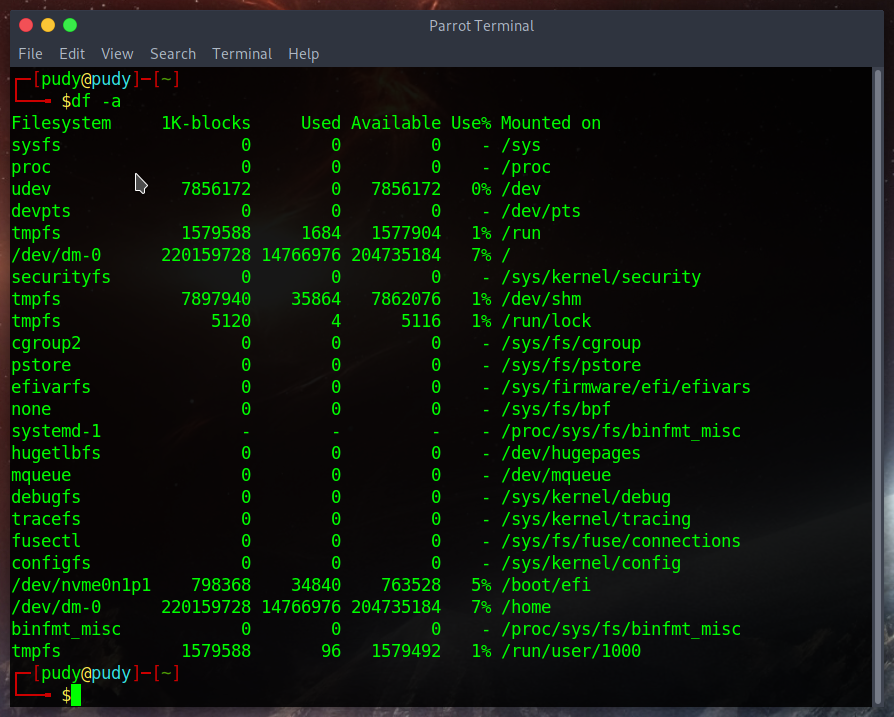
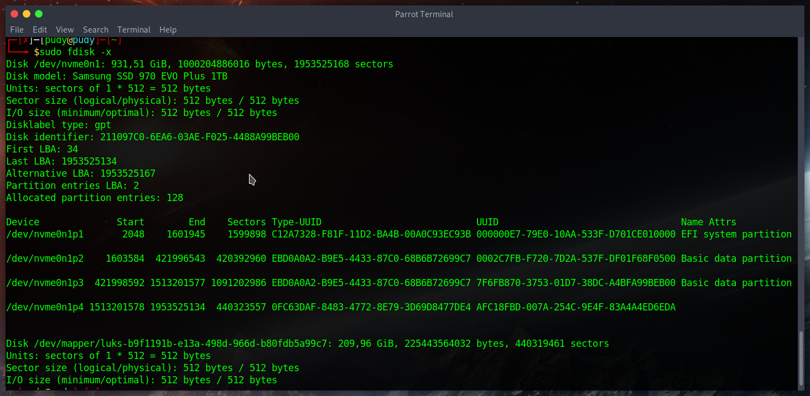
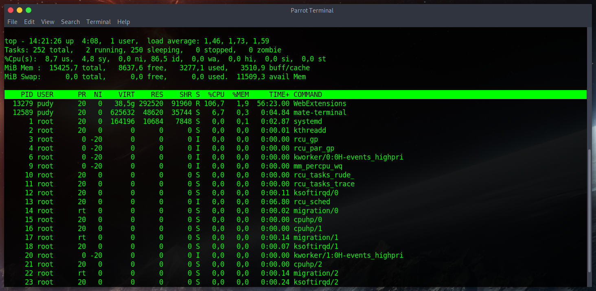
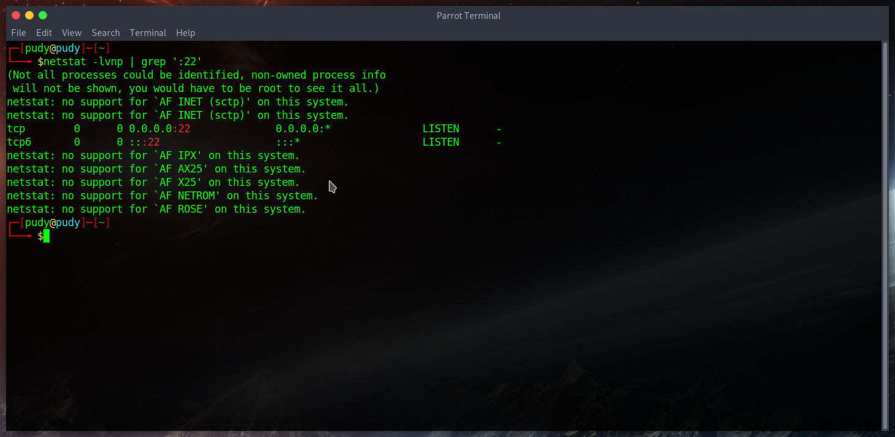
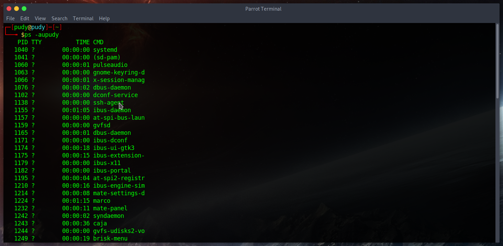
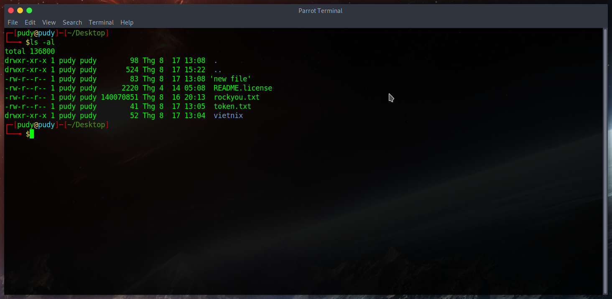
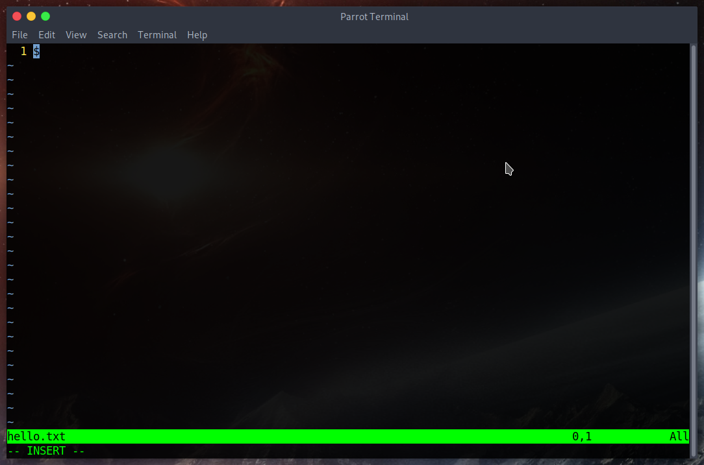

# Progression

Founded 3 :key: to :unlock: 23 :lock:

# Menu

<ol>
    <li> ✅
        <a href='#1'>
            Check diskspaces
        </a>
    </li>
    <li> ✅
        <a href='#2'>
            Check disk partitions
        </a>
    </li>
    <li> ✅
        <a href='#3'>
            Check cpu, ram
        </a>
    </li>
    <li> ✅
        <a href='#4'>
            Check network
        </a>
    </li>
    <li> ✅
        <a href='#5'>
            Check processes
        </a>
    </li>
    <li> ✅
        <a href='#6'>
            List directories
        </a>
    </li>
    <li> ✅
        <a href='#7'>
            Find file/folder
        </a>
    </li>
    <li> ✅
        <a href='#8'>
            Copy file/folder
        </a>
    </li>
    <li> ✅
        <a href='#9'>
            Move file/folder
        </a>
    </li>
    <li> ✅
        <a href='#10'>
            Rename file/folder
        </a>
    </li>
    <li> ✅
        <a href='#11'>
            Permissions
        </a>
    </li>
    <li> ✅
        <a href='#12'>
            Editor (vi/nano/gedit)
        </a>
    </li>
    <li> ✅
        <a href='#13'>
            Mount/Umount
        </a>
    </li>
    <li> ✅
        <a href='#14'>
            Symbolic Links
        </a>
    </li>
</ol>

# Main dishes
<span style="color: red;">## Warning:</span> Useful options section is in my perspective

## 1. Check diskspaces

Command:
```
df [OPTION]... [FILE]
```

Usage:
```
report file system disk space usage
```

Useful options:
```
-a, --all: include pseudo, duplicate, inaccesible file systems
-h, --human-readable: print sizes in powers of 1024 (e.g., 1023M)
--output[=FIELD_LIST]
*FIELD_LIST:
source: disk
size: the total disk value
used: the disk used in the file system
avail: the disk available in the file system
pcent: percentage diskspace used
target: mouting point
```
Image:



<div id='2'></div>

## 2. Check disk partitions

Command:

<span style="color: red;">## Warning:</span> sudo required
```
fdisk [options] device
```
```
fdisk -l [device...]
```

Usage:
```
manipulate disk partition table
```

Useful options:
```
-x: for more information
```

Image:


<div id='3'></div>

## 3 Check CPU, ram (real-time)

Command:

```
top 
```

Usage:
```
display Linux processes
```

Image:


Information:
```
PID: process ID
USER: which user running the process
PR: process priority (0-99: realtime; 100-139: user)
NI: nice value user-space
%CPU: CPU used
%MEM: memory used
TIME+: time to live
COMMAND: this pid is running this process
```

## 4 Check network

<div id='4'></div>

Command:

```
netstat
```

Usage:
```
print information about network
```

Useful options:
```
-l: show the listen socket
-t: tcp connections
-u: udp connections
-n: show numberic
-r: show routing table
-p: show process id for each socket
```
Image: In this case, I filtered port 22 by command `netstat -lvnp | grep ':22'`


## 5. Check processes
<div id='5'></div>

Command:

```
ps
```

Usage:
```
report a snapshot of the current processes
```

Useful options:
```
-aux: print all process owned by a user named x(could replace x by username)
```

Image:


## 6. List directories
<div id='6'></div>

Command:

```
ls
```

Usage:
```
list directory
```

Useful options:
```
-a: list all directories
-l: show the authority of the directory (permissions, owner, group owner, etc..)
```
Image:


### 7. Find file/folder

<div id='7'></div>

Command:

```
find 
```

Usage:
```
```

Useful options:
```
```
Image:


## 8.Copy file/folder

<div id='8'></div>

Command:

```
```

Usage:
```
```

Useful options:
```
```
Image:


## 9. Move file/folder

<div id='9'></div>

Command:

```
```

Usage:
```
```

Useful options:
```
```
Image:


## 10. Rename file/folder

<div id='10'></div>

Command:

```
```

Usage:
```
```

Useful options:
```
```
Image:


## 11. Permissions

<div id='11'></div>

Command:

```
```

Usage:
```
```

Useful options:
```
```
Image:


## 12. Editor

<div id='12'></div>

Command:

```
vi || nano || gedit <file_name>
```

Usage:
```
* For `vi`, press `i` (or INSERT) to using 'INSERT' mode. `d+d` for delete the current line, `ESC` to exit mode, `:wq!` (or `SHIFT + Z + Z`) to save and exit, `:q!` to ignore change and exit.
* For `nano`, when we editted, we can use `ctrl + s` to save and `ctrl + x` to exit
* For `gedit`, we using as notepad (not default, must installed)
```

Image:
This is `vi` in insert mode, and the mode (`INSERT` | `REPLACE` show on the bottom left of the terminal)


## 13. Mount/Umount

<div id='13'></div>

Command:

```
```

Usage:
```
```

Useful options:
```
```
Image:


## 14. Symbolic Links

<div id='14'></div>

Command:

```
```

Usage:
```
```

Useful options:
```
```
Image:
