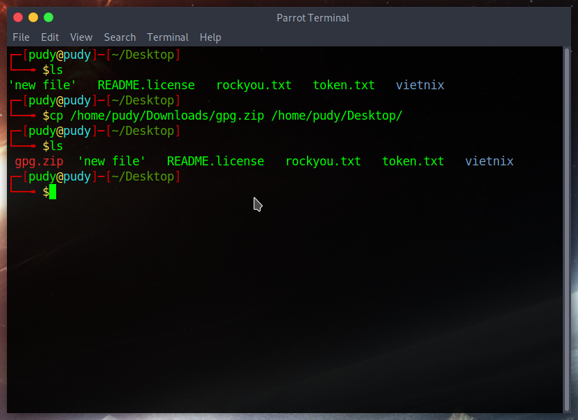
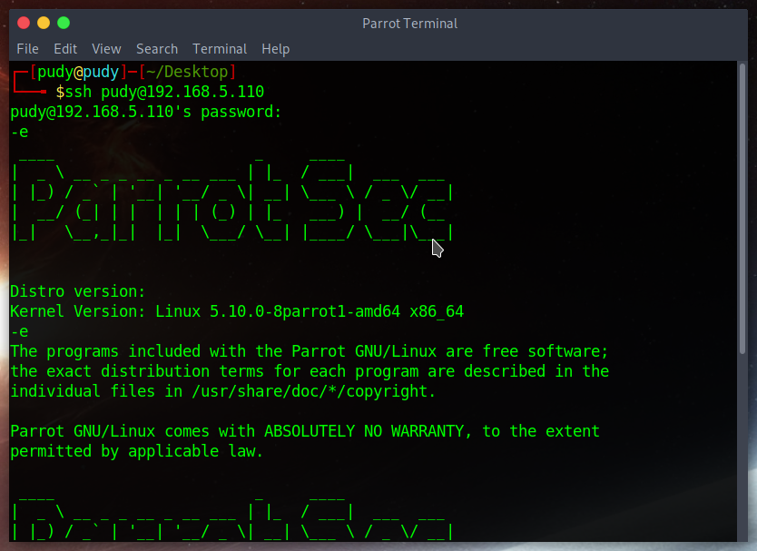

# Progression

Founded 30 :key: to :unlock: 30 :lock:

# Menu

<ol>
    <li> ✅
        <a href='#1'>
            Check diskspaces
        </a>
    </li>
    <li> ✅
        <a href='#2'>
            Check disk partitions
        </a>
    </li>
    <li> ✅
        <a href='#3'>
            Check cpu, ram
        </a>
    </li>
    <li> ✅
        <a href='#4'>
            Check network
        </a>
    </li>
    <li> ✅
        <a href='#5'>
            Check processes
        </a>
    </li>
    <li> ✅
        <a href='#6'>
            List directories
        </a>
    </li>
    <li> ✅
        <a href='#7'>
            Find file/folder
        </a>
    </li>
    <li> ✅
        <a href='#8'>
            Copy file/folder
        </a>
    </li>
    <li> ✅
        <a href='#9'>
            Move file/folder
        </a>
    </li>
    <li> ✅
        <a href='#10'>
            Rename file/folder
        </a>
    </li>
    <li> ✅
        <a href='#11'>
            Permissions
        </a>
    </li>
    <li> ✅
        <a href='#12'>
            Editor (vi/nano/gedit)
        </a>
    </li>
    <li> ✅
        <a href='#13'>
            Mount/Umount
        </a>
    </li>
    <li> ✅
        <a href='#14'>
            Symbolic Links
        </a>
    </li>
    <li> ✅
        <a href='#15'>
            Hard Links
        </a>
    </li>
    <li> ✅
        <a href='#16'>
            SSH key generator
        </a>
    </li>
    <li> ✅
        <a href='#17'>
            Compress/Decompress
        </a>
    </li>
    <li> ✅
        <a href='#18'>
            Firewall
        </a>
    </li>
    <li> ✅
        <a href='#19'>
            Transfer file via ssh
        </a>
    </li>
    <li> ✅
        <a href='#20'>
            View file content without editor
        </a>
    </li>
    <li> ✅
        <a href='#21'>
            Append file content
        </a>
    </li>
     <li> ✅
        <a href='#22'>
            nmap
        </a>
    </li>
     <li> ✅
        <a href='#23'>
            telnet
        </a>
    </li>
     <li> ✅
        <a href='#24'>
            ssh
        </a>
    </li>
     <li> ✅
        <a href='#25'>
            ping
        </a>
    </li>
    <li> ✅
        <a href='#26'>
            Redirect standard input
        </a>
    </li>
    <li> ✅
        <a href='#27'>
            Redirect standard output
        </a>
    </li>
    <li> ✅
        <a href='#28'>
            Redirect standard error
        </a>
    </li>
    <li> ✅
        <a href='#29'>
            /dev/null
        </a>
    </li>
    <li> ✅
        <a href='#30'>
            vnstat for traffic management
        </a>
    </li>
    Special:
    <a href='#0101'>
            Different between hard links and symbolic links
    </a>
</ol>

# Main dishes
<span style="color: red;">## Warning:</span> Useful options section is in my perspective

## 1. Check diskspaces

Command:
```
df [OPTION]... [FILE]
```

Usage:
```
report file system disk space usage
```

Useful options:
```
-a, --all: include pseudo, duplicate, inaccesible file systems
-h, --human-readable: print sizes in powers of 1024 (e.g., 1023M)
--output[=FIELD_LIST]
*FIELD_LIST:
source: disk
size: the total disk value
used: the disk used in the file system
avail: the disk available in the file system
pcent: percentage diskspace used
target: mouting point
```
Image:


<div id='2'></div>

## 2. Check disk partitions

Command:

<span style="color: red;">## Warning:</span> sudo required
```
fdisk [options] device
```
```
fdisk -l [device...]
```

Usage:
```
manipulate disk partition table
```

Useful options:
```
-x: for more information
```

Image:


<div id='3'></div>

## 3 Check CPU, ram (real-time)

Command:

```
top 
```

Usage:
```
display Linux processes
```

Image:


Information:
```
PID: process ID
USER: which user running the process
PR: process priority (0-99: realtime; 100-139: user)
NI: nice value user-space
%CPU: CPU used
%MEM: memory used
TIME+: time to live
COMMAND: this pid is running this process
```

<div id='4'></div>

## 4 Check network

Command:

```
netstat
```

Usage:
```
print information about network
```

Useful options:
```
-l: show the listen socket
-t: tcp connections
-u: udp connections
-n: show numberic
-r: show routing table
-p: show process id for each socket
```
Image: In this case, I filtered port 22 by command `netstat -lvnp | grep ':22'`


<div id='5'></div>

## 5. Check processes

Command:

```
ps
```

Usage:
```
report a snapshot of the current processes
```

Useful options:
```
-aux: print all process owned by a user named x(could replace x by username)
```

Image:


<div id='6'></div>

## 6. List directories

Command:

```
ls
```

Usage:
```
list directory
```

Useful options:
```
-a: list all directories
-l: show the authority of the directory (permissions, owner, group owner, etc..)
```
Image:


<div id='7'></div>

### 7. Find file/folder

Command:

```
find <directory_to_find> [options]
```

Usage:
```
search for files in a directory hierarchy
```

Useful options:
```
find / -name <file_name> 2>&1
-name: name of the file to find
-type: type of the file to find
-perm: permission of the file to find
```
Image:


<div id='8'></div>

## 8.Copy file/folder

Command:

```
cp <path_to_source_file> <path_to_dest_file>
```
```
cp -R <path_to_source_folder> <path_to_dest_folder>
```

Usage:
```
copy file/folder from source path to destination path
```

Useful options:
```
-R: recursive
```
Image:


<div id='9'></div>

## 9. Move file/folder

Command:

```
mv <path_to_source_file> <path_to_dest_file>
```

Usage:
```
move file/folder from source path to destination path
```

Useful options:
```
-i: interactive (overwrite existing)
-b: make a backup
```
<div id='10'></div>

## 10. Rename file/folder

Command:

```
mv <path_to_source_file> <path_to_dest_file>
```
OR install rename for Debian, prename for RHEL
```
rename [options]
```

Usage:
```
rename file/folder
```

Useful options:
```
-f: overwrite 
-d: rename filename component of path
```
Image:


<div id='11'></div>

## 11. Permissions

Command:

```
* Create user: useradd
* Modify: usermod
* Delete: userdel
* Change permission: chmod
* Change owner: chown
```

Example: 
`add` new user `vietnix` with uid `6868`: `useradd -u 6868 vietnix`
`add` new user in `/home/vietnix` directory: `useradd -m vietnix`

Change user information `main group` of the user `vietnix` to `www-data`:  `usermod -g www-data vietnix`
change user information `name` of the user `remoteuser` to `vsftpuser`: `usermod -l vsftpduser remoteuser`

delete user `test`: userdel -r -f test
* -r: remove `/home/test` directory and mail spool in this case
* -f: force remove of files

change permission of file `id_rsa` to user can read and write: `chmod 600 id_rsa`
change permission all file in folder `/var/www/html` to user can read, write, execute; group can read, execute and other can read, execute: `chmod -R 755 /var/www/html/`

Usage:
```
user/group administration
```

Useful options:
```
chmod -R: change permission for all file in directory
chmod -aG: change group 
```
Image:


<div id='12'></div>

## 12. Editor

Command:

```
vi || nano || gedit <file_name>
```

Usage:
```
* For `vi`, press `i` (or INSERT) to using 'INSERT' mode. `d+d` for delete the current line, `ESC` to exit mode, `:wq!` (or `SHIFT + Z + Z`) to save and exit, `:q!` to ignore change and exit.
* For `nano`, when we editted, we can use `ctrl + s` to save and `ctrl + x` to exit
* For `gedit`, we using as notepad (not default, must installed)
```

Image:
This is `vi` in insert mode, and the mode (`INSERT` | `REPLACE` show on the bottom left of the terminal)


<div id='13'></div>

## 13. Mount/Umount

Command:

```
mount <from> <to>
umount <from> <to>
```

Usage:
```
mount the file systems to devio
```

Useful options:
```
```
Image:
Here, I have a device. If I want to use it, i must mount it to the file system

Here is my rescue USB after mounting

Umount


<div id='14'></div>

## 14. Symbolic Links

** Delete src file will make the link file broken
Command:

```
ln -s [target file] [symbolic filename]
```
* Delete symlink:
```
unlink [symlink to remove]
```

Usage:
```
make sym link between file/folder => like shortcut in Windows
```

Useful options:
```
-b: backup
-f: force
```
Image:


<div id='15'></div>

## 15. Hard Links

Command:

```
ln [target file] [symbolic filename]
```

Usage:
```
make link between file/folder => like shortcut in Windows
```

Image:


<div id='0101'></div>

** Different between hard links and symbolic links:

    inode: is the index that referer to a memory location

Hard links: 

Pros:
```
same inode when linking, easy to find
can work-well with almost application
when delete source file, the link still existed
```
Cons:
```
Cannot link to another filesystems
Cannot hard link directory
```

Symbolic links:

Pros:

```
Different inode when linking
Can link the directory
```

Cons:

```
When delete a source file, the file link does not existed
```

<div id='16'></div>

## 16. SSH key generator

Command:

```
ssh-keygen <options> <...>
```

Usage:
```
generator ssh keygen
```

Useful options:
```
-t: type of key to create (rsa|dsa|ecdsa...)
```
Image:


After generation progress, `ssh-keygen` will output 1 public key `id_rsa.pub` (for server) 1 private key `id_rsa` (for client) to authenticate  

<div id='17'></div>

## 17. Compress/Decompress

Command:

```
tar [options] <file_name>
```

Usage:
```
an archieving utility
```

Useful options:
```
-cvf: compress .tar
-zcvf: compress .tar.gz
-cvjf: compress .tar.bz2
-xvf: decompress .tar
-C: extract to
-tvf: list content in compressed file
```
Image:
* Compress


* Decompress


<div id='18'></div>

## 18. Firewall

Command:

```
ufw
```
```
iptables
```

Usage:
```
ufw need to installed manually
```

Useful options:
```
status
allow
reject
```
Image:


<div id='19'></div>

## 19. Transfer file via ssh

Command:

```
scp <src> <dest>
```

Usage:
```
transfer file from local host to remote host via ssh (ssh started)
```

Useful options:
```
-R: directory
```
Image:


<div id='20'></div>

## 20. View file content without editor

Command:

```
grep [file_name_pattern] <file_name> (pr file path)
```
```
while read line; do echo $line; done < [file_name]
```

Usage:
```
view file content without editor
```

Useful options:
```
-R: recursive (view all file content in directory)
```
Image:


<div id='21'></div>

## 21 Append file content

Command:

```
echo "<content>" >> <file_path> (or file name)
```

Usage:
```
append file content
```

Useful options:
```
>: overwrite 
```
Image:


<div id='22'></div>

## 22. nmap

Command:

```
nmap <ip>
```

Usage:
```
port scanning
```

Useful options:
```
-sT: scan TCP
-sC: default script
-sV: version detection
-O: discovery OS
-oN: output file
```
Image:


<div id='23'></div>

## 23. telnet

Command:

```
telnet <ip> (port)
```

Usage:
```
terminal network
```

Useful options:
```
-l: user
```
Image:


<div id='24'></div>

## 24. ssh

Command:

```
ssh <username>@<host>
```

Usage:
```
secure shell 
```

Useful options:
```
-q: quiet mode
```
Image:


<div id='25'></div>

## 25. ping

Command:

```
ping <ip>
```

Usage:
```
ICMP echo request
```

Useful options:
```
-I: by interface
--t: TTL
```
Image:


<div id='26'></div>

## 26. Redirect standard input

Command:

```
0>
```

Usage:
```
Standard input is read from the keyboard
```

<div id='27'></div>

## 27. Redirect standard output

Command:

```
1>
```

Usage:
```
Standard output is read from the screen
```
<div id='28'></div>

## 28. Redirect standard error

Command:

```
2>
```

Usage:
```
Standard error is read from the screen
```

Image:


<div id='29'></div>

## 29. /dev/null

Command:

```
>/dev/null
```

Usage:
```
garbage data storage
```

Image:


<div id='30'></div>

## 30. vnstat for traffic management

Command:

```
vnstat
```

Usage:
```
traffic management
```

Useful options:
```
-m: monthly
```
Image:

