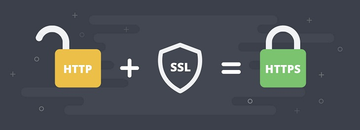
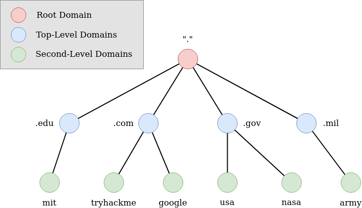
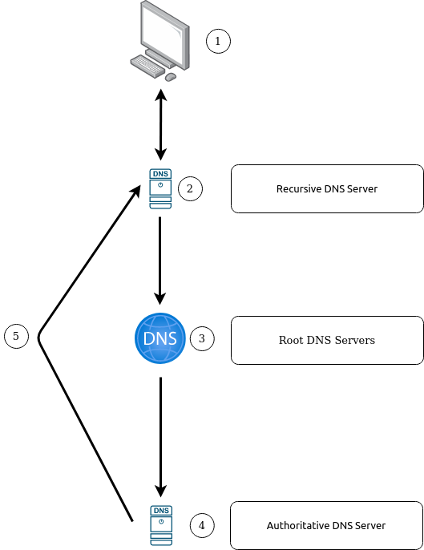
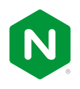

# Progression

Founded 5 :key: to :unlock: 5 :lock:

# Menu

<ol>
    <li> ✅
        <a href='#1'>
            SSL
        </a>
    </li>
    <li> ✅
        <a href='#2'>
            Domain
        </a>
    </li>
    <li> ✅
        <a href='#3'>
            DNS
        </a>
    </li>
    <li> ✅
        <a href='#4'>
            Hosting, vps, server
        </a>
    </li>
    <li> ✅
        <a href='#5'>
            Reverse proxy
        </a>
    </li>
    <li> ✅
        <a href='#6'>
            Differentation between Nginx vs.Apache
        </a>
    </li>
</ol>

# Main dishes

<div id='1'></div>

## 1. SSL (Secure Sockets Layer)



* What is SSL?

```
SSL is a security protocols, an ancestor of TLS (Transport Layer Security) certificate. SSL is a standard for the security, encryption between in the client-server model, it help the data transfer in client-server model secure by encrypt data.
```

* Type of SSL:

```
POSITIVE SSL: Used for 1 domain
POSITIVE SSL WILDCARD: Used for the whole domain
POSITIVE SSL EV: Used for organization
```

* Some important terms in SSL

```
CSR (Certificate Signing Request): is a text contain the information of the encrypted domain. This sent to the SSL service provider to authentication

CRT (Certification): The confirmation from the SSL service provider (valid or not valid)

Private key: is the key sent to the SSL server for authentication

CA (Certificate Authority): organization that confirm the SSL cert.
```

<div id='2'></div>

## 2. Domain

* What is a domain?

```
Domain is a URL of the website that you want to access. For example, you want to enter www.google.com so the domain is google
```

* Domain hierarchy show below:



(source: https://tryhackme.com)

<div id='3'></div>

## 3. DNS

* What is a DNS(Domain Name System?

```
TryHackMe: "DNS (Domain Name System) provides a simple way for us to communicate with devices on the internet without remembering complex numbers. Much like every house has a unique address for sending mail directly to it, every computer on the internet has its own unique address to communicate with it called an IP address".
The IP address is pretty hard for remember so DNS help us. It translate the domain that we want to enter to the ip address of that domain.
For example: https://vietnix.vn -> 103.200.21.192:443
```

* DNS's records

```
A Record: These records resolve to IPv4 addresses.

AAAA Record: These records resolve to IPv6 addresses.

CNAME Record: These records resolve to another domain name.

MX Record: These records resolve to the address of the servers that handle the email for the domain you are querying.

TXT Record: TXT records are free text fields where any text-based data can be stored. TXT records have multiple uses, but some common ones can be to list servers that have the authority to send an email on behalf of the domain (this can help in the battle against spam and spoofed email). They can also be used to verify ownership of the domain name when signing up for third party services.

NS Record: These record store Name Server record for DNS entry.

SOA Record: These record  store admin information about a domain.

SRV Record: These record specifies a port for specific services.

PTR Record: These record provide a doamin name in reverse-lookups.
```

* Make DNS request progression show below



(source: https://tryhackme.com)

<div id='4'></div>

## 4. Definition for hosting, vps, server

* What is hosting?

```
Hosting is a storage space seperate from the server which can help storage, upload, hosting website or run the application over the internet. You need upload the requirement file/setup to the server to use the website or application.
```

* What is vps?

```
VPS (Virtual Private Server): is a virtual machine that serve the Internet hosting service. A VPS runs its own copy of an Operating System (OS). It could be use for multiple purpose that up to the customer
```

* What is server?

```
Server is a virtual machine or physical machine that provides resouces, data, services, or programs to the client over the network.
```

<div id='5'></div>

## 5. Reverse proxy

* What is the reverse proxy?

```
Reverse proxy usally use from the server. The request from the client to the proxy server. After that, the proxy server forward the request to the server backend
```

* Reverse proxy purpose:

```
Load balancing: maximium the availability for the client used (if the accident exposed)  
Increased security: hide the real IP address of the backend server
Logging: access management
Encrypted connected: encrypted data with TLS
```

<div id='6'></div>

## 6. Differentation between nginx vs Apache

Both nginx and apache is a application that serve as the web hosting server, but these 2 have their own duty.



* nginx: serve the server that processing big traffic

Cons
```
Open-source 
Event processor: the master process manage the worker processes to query
Serve the static file, indexing
Accelerate reverse proxy by cache
Fault-tolerant, load balancing (high-availability)
Support SSL/TLS encryption
Modul architecture
Loging
Rewrite URL
Support IPv6
Support WebSockets
Support transfer FLV, MP4
```

Pros:
```
Complex to configuration
```


* Apache: easy to use and setup, friendly-environment 

Cons
```
Open-source
Thread processor:
Modul architecture
Multiple platforms
Work-well with Wordpress
Easy to setup
Big comunity
```

Pros:
```
Low-availability
"Resource thirsty"
Security probliem with many module
```