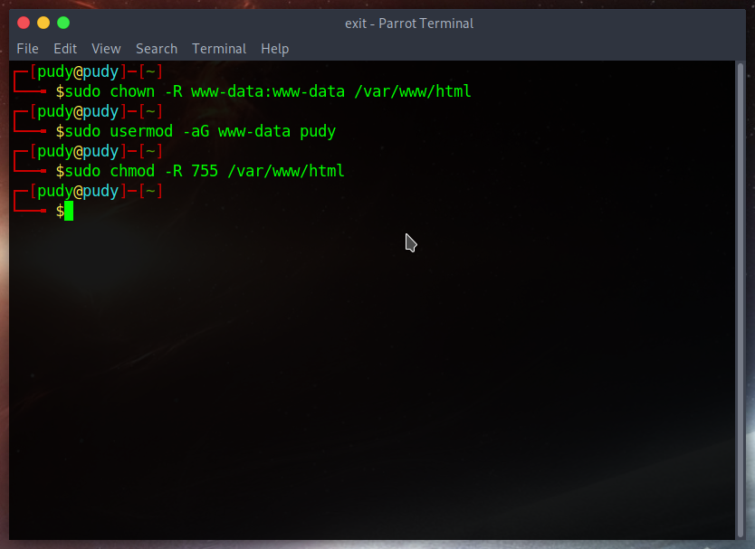
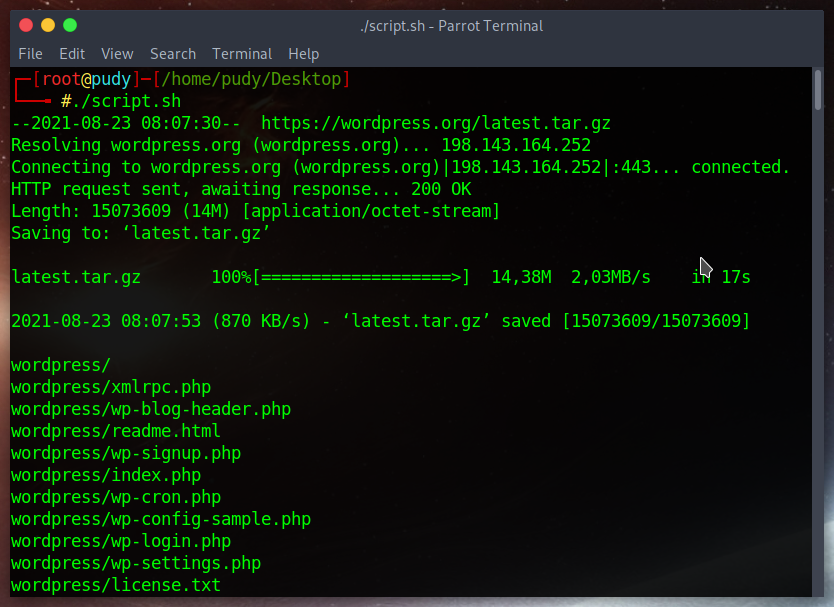
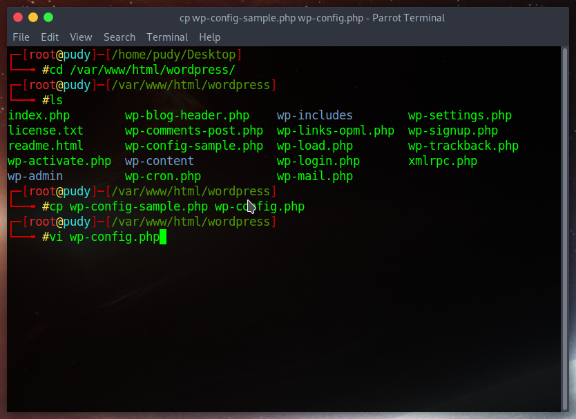
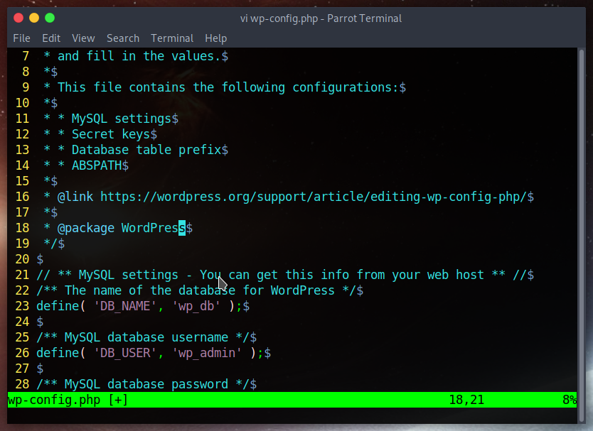
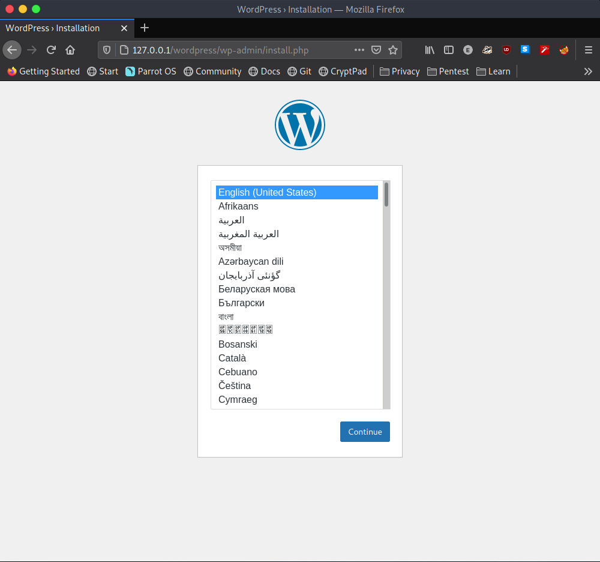
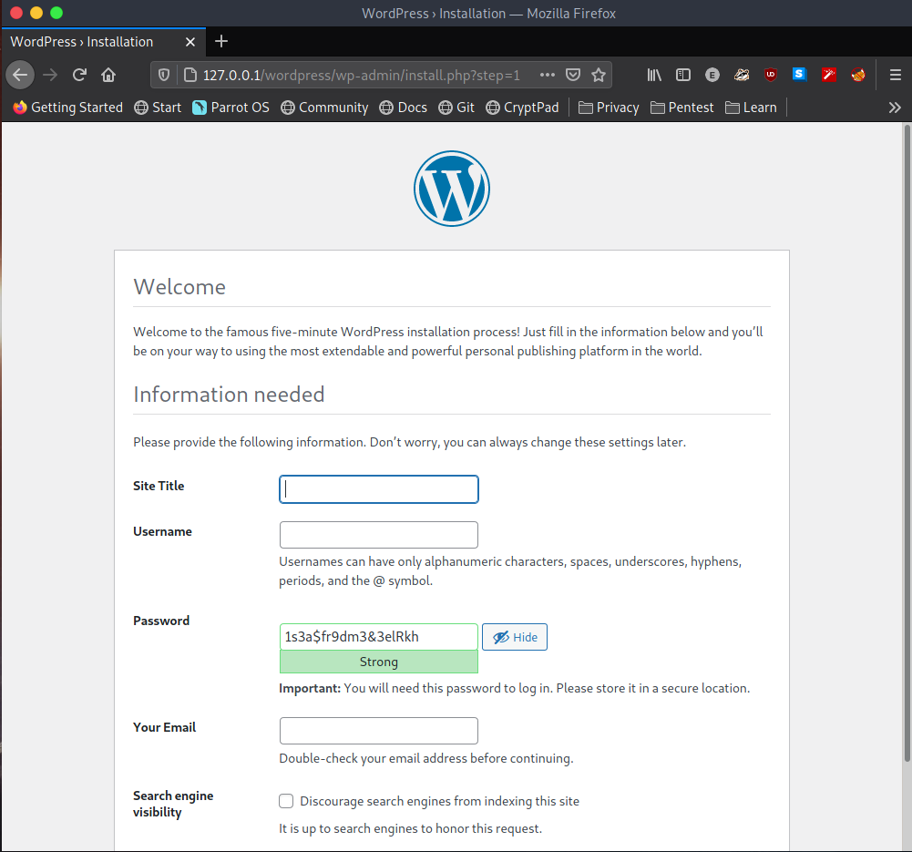
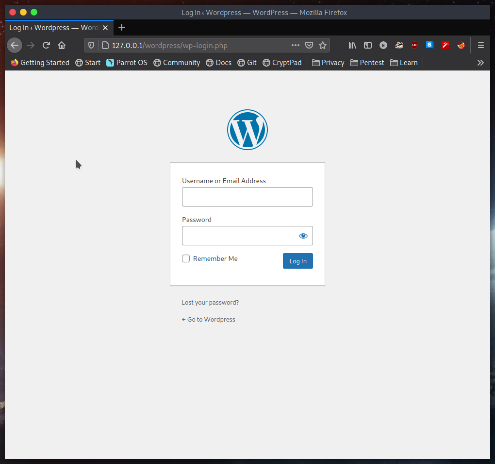

# Progression

Founded 0 :key: to :unlock: 2 :lock:

# Menu

<ol>
    <li> ✅
        <a href='#1'>
            LAMP stack
        </a>
    </li>
    <li> ✅
        <a href='#2'>
            LEMP stack
        </a>
    </li>
</ol>

# Main dishes

I using <span style="color: red;"> Debian </span> base for this meal

## 1. LAMP stack


* What is LAMP?

```
LAMP stands for Linux, Apache, MySQL, and PHP.
```

* Why LAMP:

```
Open-source and non-proprietary
Security architecture and well-established encryption
Smooth-performance
```

<h2><b> LAMP stack installing </b></h2>

<h3><b>Apache</b></h3>

Install apache: `sudo apt-get install apache2` 


Start service and check status of Apache


Apache privilledge setup:



<h3><b>MySQL</b></h3>

Install MySQL: `sudo apt-get install mysql*`


Security configuration for MySQL: `mysql_secure_installation` (must be root user)


After secured


<h3><b>PHP</b></h3>

Install PHP: `sudo apt-get install php libapache2-mod-php php-mysql`


<h3><b>Test LAMP stack</b></h3>

* Test PHP


Test in apache web server `localhost/phpinfo.php`


It worked!

<h2><b>Build Wordpress + LAMP: CMS and web server</b></h2> 

* Create database for wordpress management:

```
mysql -uroot -p => enter password

mysql> CREATE DATABASE wp_db;
mysql> GRANT ALL ON wp_db.* TO 'wp_admin'@'localhost' IDENTIFIED BY '<password_here>';
mysql> FLUSH PRIVILLEGES;
```


* Installing additional PHP extensions:

```
sudo apt-get install php php-curl php-gd php-mbstring php-xml php-xmlrpc php-soap php-intl php-zip
```


* Installing WordPress on LAMP:

I use the <a href=https://raw.githubusercontent.com/exortv123/vietnix-report/master/section3/installWP.sh>script</a> (must be root for installing this)



Config database in WP (change the owner to www-data)



Change DB_NAME, DB_USER, DB_PASSWORD, DB_HOST(if do not use localhost)







After installed, WordPress notifies you that it was installed, and redirects to the login page.



Done!


## 2. LEMP stack