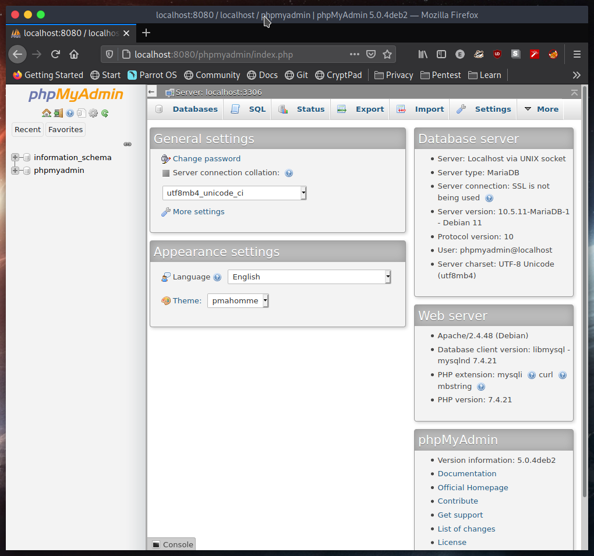

# Progression

Founded 2 :key: to :unlock: 2 :lock:

# Menu

<ol>
    <li> ✅
        <a href='#1'>
            Nginx as reverse proxy and Apache2 as web server
        </a>
    </li>
    <li> ✅
        <a href='#2'>
            Remote Access MySQL
        </a>
    </li>
    <li> ✅
        <a href='#3'>
            VSFTPD
        </a>
    </li>
    <li> ✅
        <a href='#4'>
            PHPmyadmin
        </a>
    </li>
    <li> ✅
        <a href='#5'>
            Wordpress installation in this stack
        </a>
    </li>
</ol>

# Main dishes

This one only use localhost (domain duynp.info does not worked)

<div id='1'></div>

## 1. Nginx as reverse proxy and Apache2 as web server
* Change default port 80 of Apache web server to another one

Change in `/etc/apache2/ports.conf`


* Add proxy_pass directive to `location /` of the file `/etc/nginx/sites-enabled/<name>` 

    Syntax: `proxy_pass` <ip_address>;


Result:


<div id='2'></div>

## 2. Remote Access MySQL

Comment `bind-address = 127.0.0.1` in file `/etc/mysql/mariadb.conf.d/50-server.cnf`


By default, if mysql not allowed to connect to MySQL server


```
CREATE USER 'USERNAME'@'IP_ADDRESS' IDENTIFIED BY 'PASSWORD';

GRANT ALL PRIVILEGES ON *.* TO 'USERNAME'@'IP_ADDRESS' WITH GRANT OPTION;
```


<div id='3'></div>

## 3. VSFTPD

Install vsftpd `sudo apt-get install vsftpd`


Configuration file in `/etc/vsftpd.conf`

```
listen=YES
anonymous_enable=NO
write_enable=YES
*pasv_enable=YES
```

*Is using in case that do not have SSL certificate.

And I using userlist to access FTP, I create user ftpuser and connect to port 21


<div id='4'></div>

## 4. PHPmyadmin

Install by `sudo apt-get install phpmyadmin` and setup password


Configure phpmyadmin in `/etc/phpmyadmin/config-db.php`

After that, we can test `localhost:<port>/phpmyadmin`


Dashboard



<div id='5'></div>

## 5. Wordpress installation in this stack

Create database in phpmyadmin and install by using the <a href=https://raw.githubusercontent.com/exortv123/vietnix-report/master/script/iLAMP_WP.sh>script</a>


