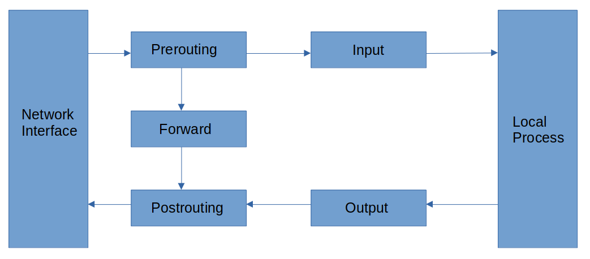
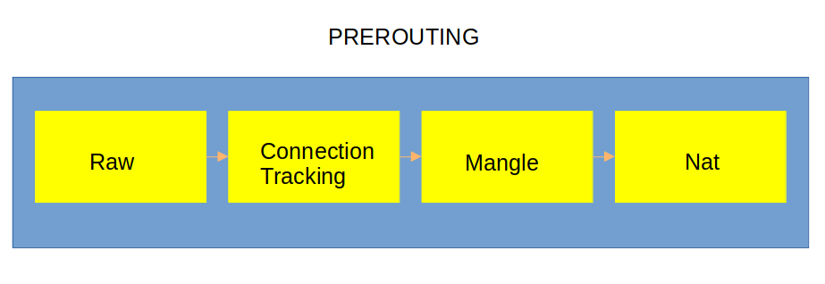
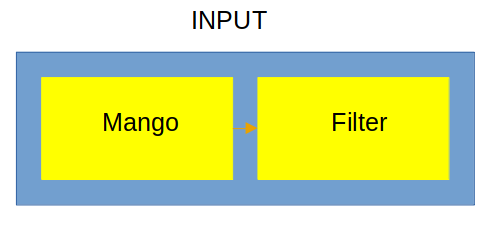
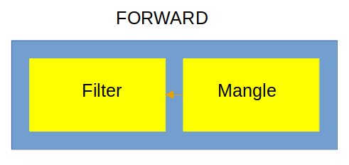
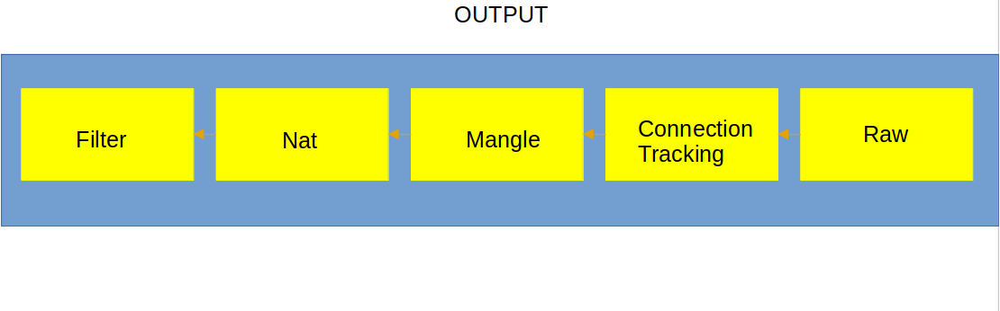
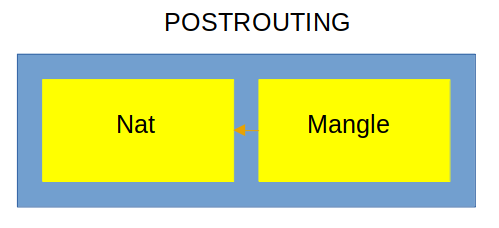
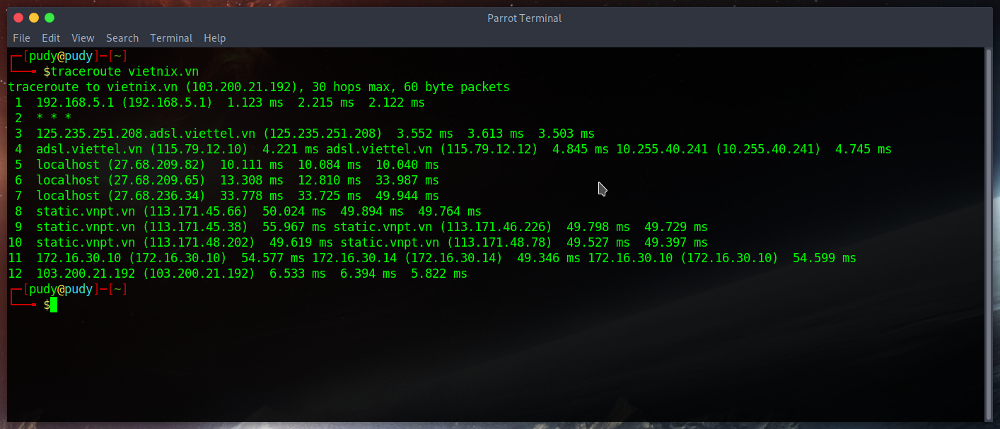
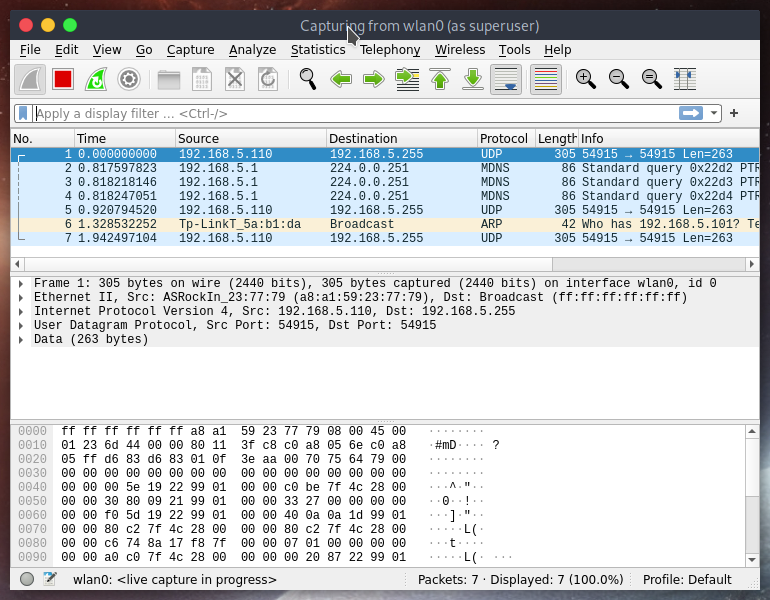
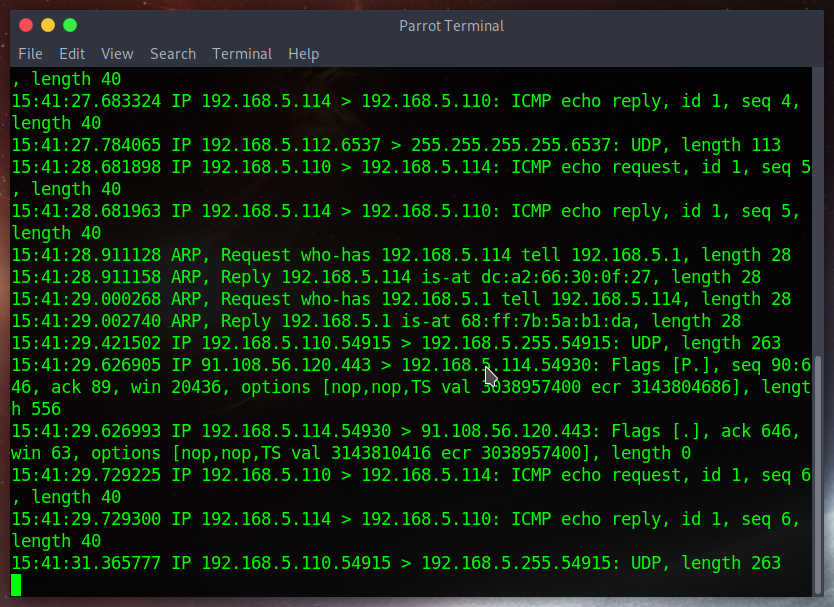

# Progression

Founded 4 :key: to :unlock: 4 :lock:

# Menu

<ol>
    <li> ✅
        <a href='#1'>
            iptables package flow diagram
        </a>
    </li>
    <li> ✅
        <a href='#2'>
            trace the packet
        </a>
    </li>
    <li> ✅
        <a href='#3'>
            iptables rules
        </a>
    </li>
    <li> ✅
        <a href='#4'>
            tcpdump
        </a>
    </li>
</ol>

# Main dishes

<div id='1'></div>

## 1. iptables package flow diagram

iptables works with 3 components: table, chain, target. It process the packet by the administrator set. If the administrator set is not specified, it works with the filter table.

When a packet came, iptables compare with each rule in the chain. If the packet does not match any rule of the chain, iptables apply the "default policy", that mean accept the packet.

KEY TERMS:

* CHAINS:



CHAIN PREROUTING: the rule in this chain execute `by the time that packet going to the Network Interface`



CHAIN INPUT: the rule in this chain execute `by the time before the packet going to Process`



CHAIN FORWARD: the rule in this chain execute for the packet `transfer from current host`



CHAIN OUTPUT: the rule in this chain execute `by the time after the packet going to Process`



CHAIN POSTROUTING: the rule in this chain execute `by the time that the packet going out from the Network Interface`



* Chain Traversal Order

```
For example, the server routing a packet and the rule of the firewall allow them transfer:

    Incoming packets destined for the local system: PREROUTING -> INPUT
    Incoming packets destined to another host: PREROUTING -> FORWARD
    Locally generated packets: OUTPUT -> POSTROUTING
```


* TABLES: 

```
Filter tables: used to filter packets
Mango table: Modify the packet header(TTL, MTU, ToS)
Table Nat: provide network address translation rule 
Table raw: connection tracking
Security tables (new feature): SELinux
```

Connection tracking is `depended on the raw table` and `matched the state of the connection`. The tracking system provide for `iptables` neccessary function to active stateful. The conntecion tracking apply in the networking stack. The system match each packet on a set of current connection. The system `update` the status of the connection on there storage and `add` if necessary.
For each packet marked as `NOTRACK` and the table raw close the tracking connection

## 2.trace the packet

There are 2 way to trace the packet that I know: traceroute and using wireshark for capture packet

* Command for traceroute: `traceroute <host>`



and wireshark:



## 3.iptables rules

use the command `iptables -L -v` to watch rule list:
```
TARGET  PROT    OPT IN  OUT SOURCE  DESTINATION

TARGET: ACCEPT/DROP/REJECT/LOG
PROT (protocol): tcp/udp/all
IN: come in rule apply for packet from which interface or any interface
OUT: go out rule apply for packet from which interface
DESTINATION: packet destination
```

Some common rule

```
## ACCEPT THE PACKET GO THROUGH INTERFACE wlan0
iptables -A INPUT -i wlan0 -j ACCEPT

## SAVE THE CURRENT CONNECTION
iptables -A INPUT -m state --state ESTABLISHED,RELATED -j ACCEPT

## ACCEPT EXTERNAL TCP CONNECTION THROUGH PORT 22 
iptables -A INPUT -p tcp --dport 22 -j ACCEPT

## DELETE 1 RULE (RULE 4th IN THIS SITUATION)
iptables -D INPUT 4

## DELETE ALL ACCEPT RULE IN IPTABLES:
iptables -D INPUT -j ACCEPT
```

* Matching: 

For each qualified packet (sastified the rule) go through or target executed is rule matched.

iptables have extensions that could be scaled by the administrator. More over, the rule match could be build from `protocol`, `destination address`, `source address`, `source port`, `destination port`, `source network`, `input interface`, `output interface`, `header` or `other state` of the connection.

* Targets:

Targets is an action that triggered after the rule completely matched. There are 2 type of targets:

    `Terminating targets`: depending on the rule is setting up, it could be DROP, ACCEPT, REJECT

    `Non-terminating targets`: is the target that execute action and check the packet follow the other rule
    
    * Here is a special infinity target: `Jumping target`: the availability of each targe with the rules will depend on context. For example, the table and the chain might dictate the targets available. The extensions activated in the rule and the matching clauses can also affected the availability of targets.

Some common targets ooption:

```
ACCEPT: allow packet go to system
DROP: deny packet
REJECT: deny packet
LOG: accept packet but loging
```
## 4.tcpdump

* Usage: dump traffic on a network

tcpdump is "terminal" version of wireshark and after close the connection, it will show us the `packet capture`, `packet received by filter`, `packet drop by kernel`

* Command: `tcpdump [options]`

* FLAG: 

S(SYN): use in TCP three-way handshake connection
.(ACK): notify that the packet sent
F(FIN): close TCP connection
P(PUSH): end of the connection for marked
R(RST): reset connection

* There are some common options in tcpdump:

```
-i: Interface
-D: list all interface that tcpdump can capture
-c N: capture N packet
-n: do not translate IP to hostname
-nn: same as -n but not translate portname
-v: verbose; -vv: +verbose; -vvv: ++verbose
-s: snaplength
-q: less Information
-w <filename>: output captured packet to file with <filename>
-e: change the way to show IP to MAC
```

* common filter:

```
dst A
src A
host A
port / port range
less
greater
(ether | ip) broadcast
udp, tcp, icmp, ipv6 => tcpdump udp
```

* Example: I using tcpdump to trace the ICMP_ECHO_REQUEST from 1 host to another host in LAN network



* Useful example:

```
list all interface
tcpdump -D

filter interface eth0 and host 192.168.5.111
tcpdump -i eth0 host 192.168.5.111

filter interface eth0 and destination 192.168.5.255 
tcpdump -i eth0 dst 192.168.5.255

filter ACK flag
tcpdump tcp[13] & 16 != 0 

filter SYN/ACK flag
tcpdump tcp[13]=18
```