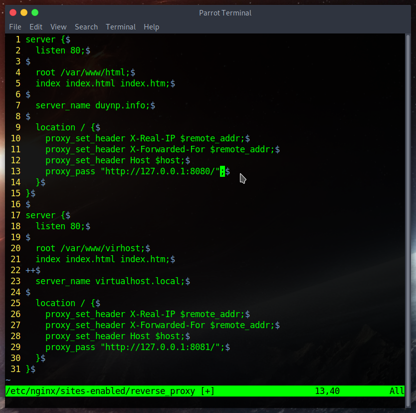
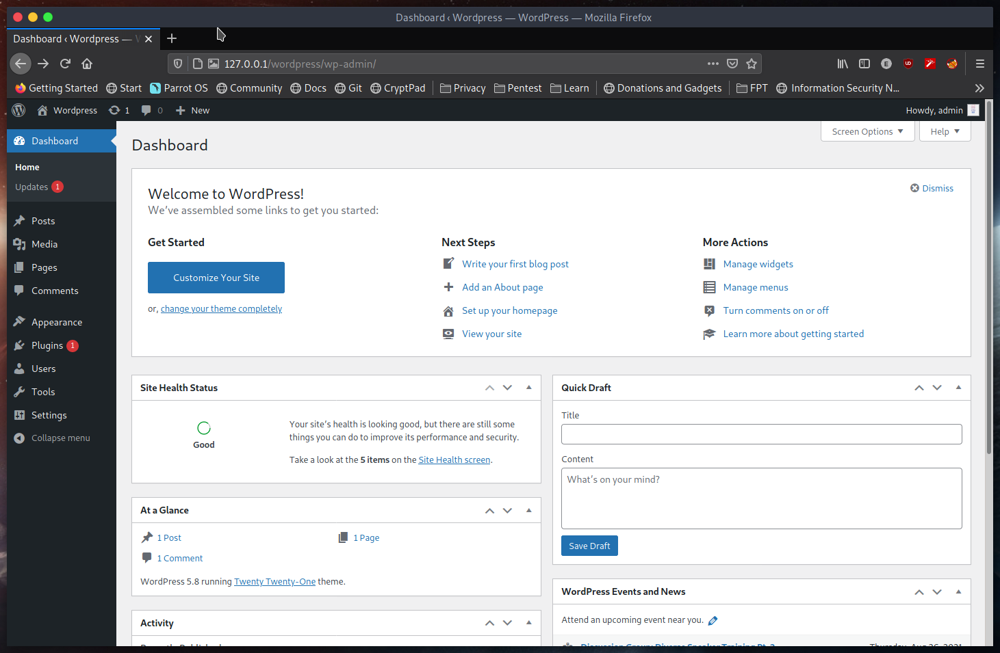

# Progression

Founded 2 :key: to :unlock: 2 :lock:

# Menu

<ol>
    <li> ✅
        <a href='#1'>
            Settings up
        </a>
    </li>
    <li> ✅
        <a href='#2'>
            Test the result
        </a>
    </li>
</ol>

# Main dishes

This one using `Apache` as `web server` and `nginx` as `reverse proxy`
=> Using for multiple site with `nginx` reverse proxy  

## 1. Settings up

Add listen port `8081` to `/etc/apache2/ports.conf`

Create new site and setup permissions for `virtualHost`

Disable default configuration

Create the configuration file in `/etc/apache2/sites-enabled/virtualHost.conf`

Enable file to by command `a2ensite <conf_name>` it actually make a link to `/etc/apache2/sites-enabled/`

Restart apache2 `sudo service apache2 restart`

Edit `reverse_proxy` in `/etc/nginx/site-available` (linked to `/etc/nginx/site-enabled)

** Hosts file

Edit `/etc/hosts`

## 2. Test the result

Test virtualhost. It's worked!!!

Login `wordpress` user account

Next, let's create a blog and test it.

Chill~! 

Click on `Publish`, and it send us an address:

